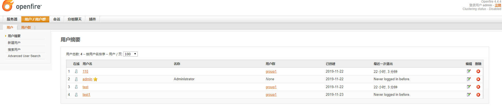
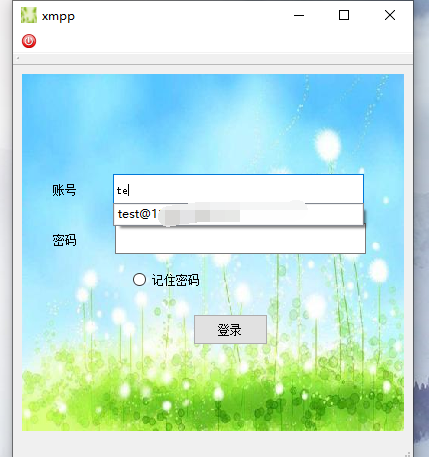
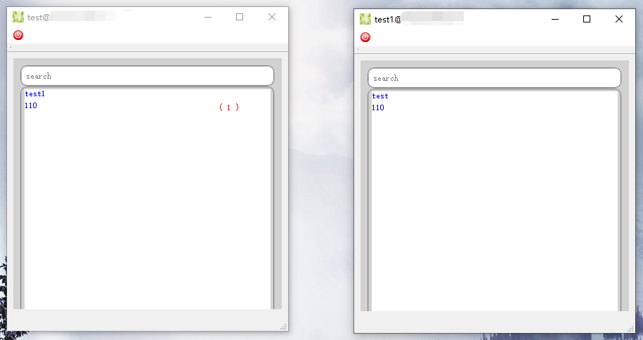
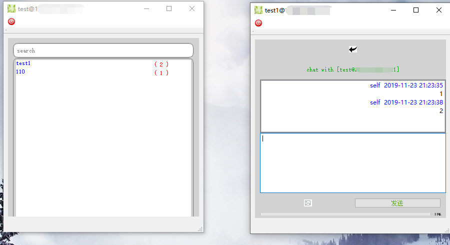
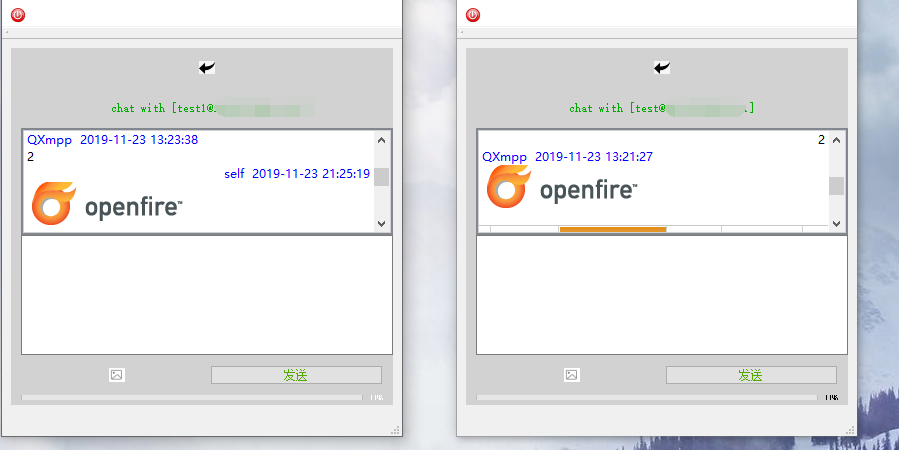

# 简单的短信收发客户端
## 功能
* 图片收发
* 文字收发
* CALL--功能不必要，且占带宽，不考虑添加 [视频音频等与平台相及软硬件相关度较大，需要部分相关知识，QXmpp也做了封装] 
* 好友管理功能--功能不必要，不考虑添加

## em..
* 工程名没大讲究
* 前端没太讲究，且控件功能简单
* 为了支持部分移动设备，主体widget选择了stackwidget
* 1个不讲究的玩意

## 作用
* 绕过第三方服务，使用自己的服务器进行推送
* 异常消息及截图推送, 如服务器异常日志等

## 协议
* LGPL

## 第三方库
* QXmpp [document](http://doc.qxmpp.org/qxmpp-1.0.0/) &nbsp;&nbsp;&nbsp;&nbsp; [git](https://github.com/qxmpp-project/qxmpp)

## 开发工具
* SDK: Qt5.12
* IDE: QtCreator4.8.2

## openfire做服务端测试效果图
 

## 业余产物，可优化项较多

## warnning
* license LGPLv3
* 源码在引人Qxmpp时是把源码导入工程一起编译 
* 如商业用途，请采用合理方法规避LGPL造成部分源码需开放问题。
* 编译std需c++11及以上

